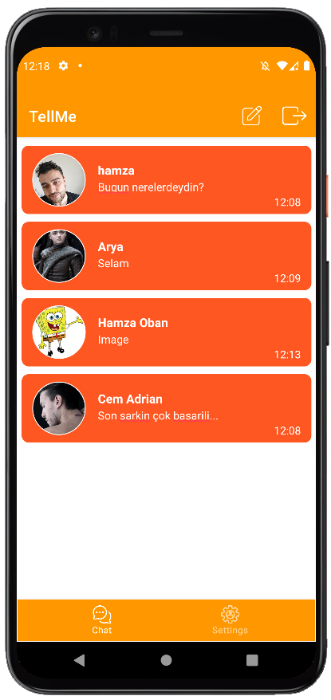
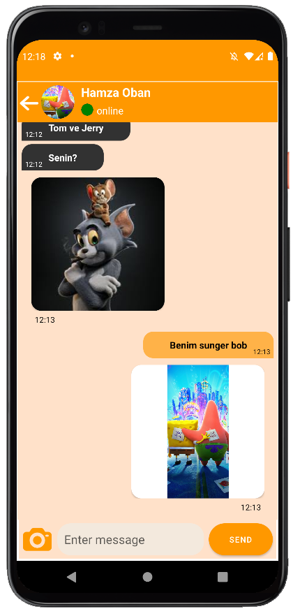

# TellMe-Android
An application that we can instant message.

# Features
- Messaging
    - Send and Receive messages with users
    - Send pictures
    - is he writing? you can see this
    - is it online? you can see.
- Latest Messaging
    - List with your Latest Messages
- Profile
    - Update your Profile Picture
    - Update your Status
    - Update your User Name
- Notifications
    - Notification when you have a new message
- Friend Detail
    - You can see your friend's details during a conversation
- Local database
    - see messages while offline
    - see your friends list while offline

Latest Messages|  Chat Screen
:-------------:|:-------------------------:
  |  
     

# What you will learn
- MVVM pattern
- Firebase authentication
- Firebase storage
- Firebase messaging service
- Activity, Fragment
- Retrofit
- Room(Database, Data Access Object, Entities)
- LiveData
- Interprocess communication(Activity ->Fragment, Fragment ->Activity)
- ViewModel test
- DataBinding
- ViewBinding
- Backend Service
- Coroutines
- [Picasso](https://github.com/square/picasso)
- [zoomage](https://github.com/jsibbold/zoomage)

